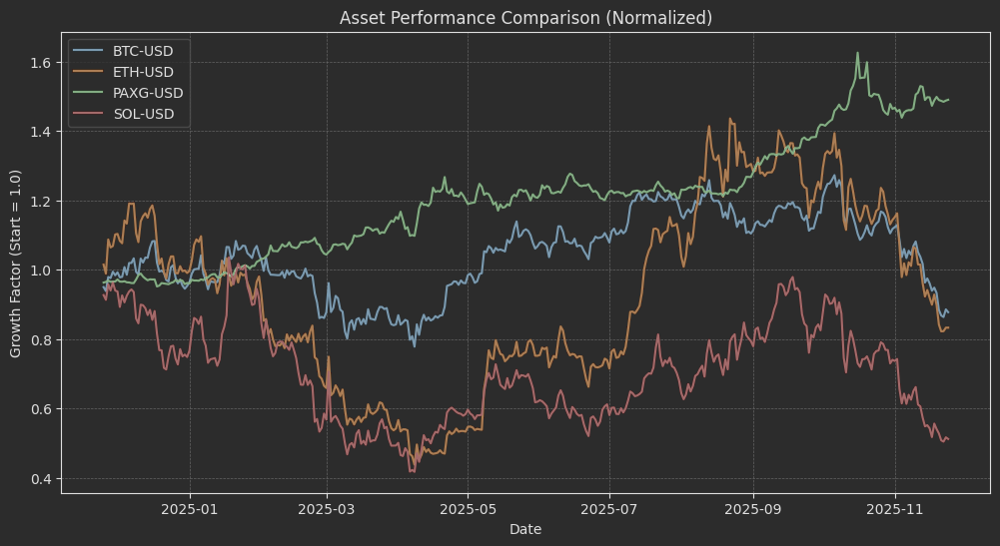
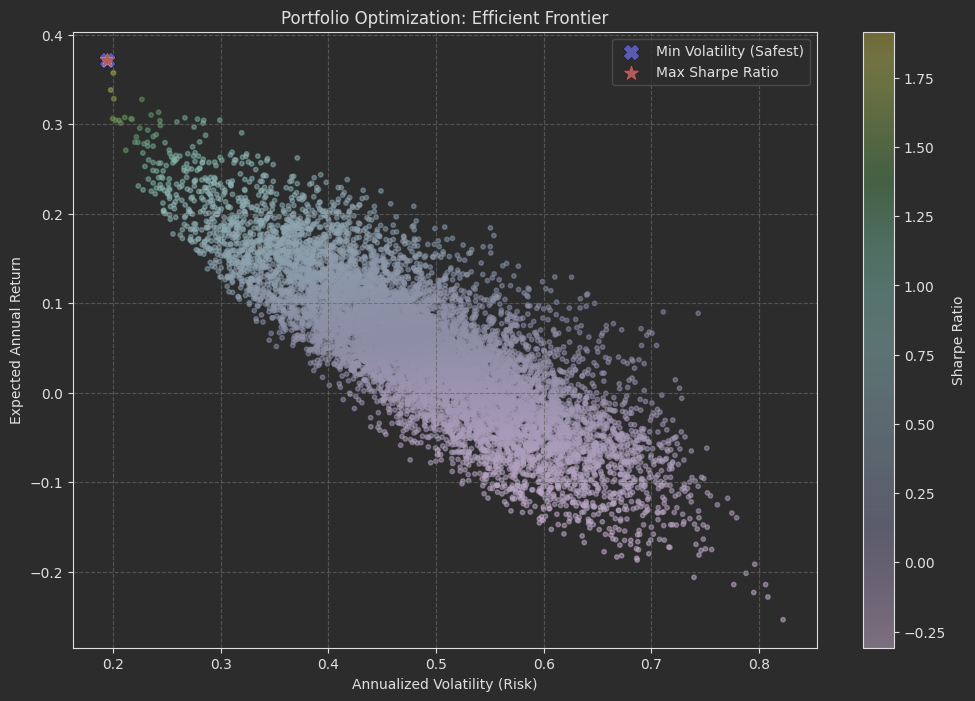
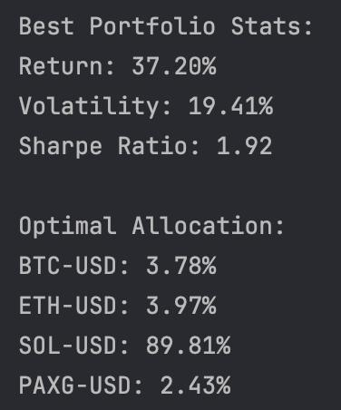
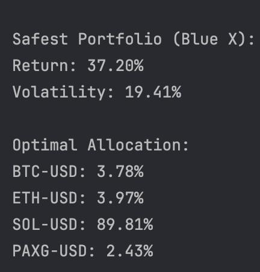

# 📚 Introduction

Cryptocurrency markets are known for their extreme volatility. For an investor, the key challenge 
isn't just picking the right asset, but finding the right **balance** between risk and reward.

This project explores [**Modern Portfolio Theory (MPT)**](https://en.wikipedia.org/wiki/Modern_portfolio_theory) to solve the asset allocation problem. 
By analyzing historical data of major cryptocurrencies (**Bitcoin, Ethereum, Solana**) alongside a 
stability asset (**Gold/PAXG**), I aimed to construct an [**"Efficient Frontier"**](https://en.wikipedia.org/wiki/Efficient_frontier) 
— a set of optimal portfolios that offer the highest expected return for a defined level of risk.

The goal is to move beyond simple [**"HODLing"**](https://corporatefinanceinstitute.com/resources/cryptocurrency/hodl/) 
and apply quantitative methods to optimize investment strategies.

# 🛠️ Background

This analysis is grounded in [**Modern Portfolio Theory (MPT)**](https://en.wikipedia.org/wiki/Modern_portfolio_theory), 
a framework introduced by Nobel laureate Harry Markowitz. The core idea is that asset diversification 
can reduce the overall risk of a portfolio without necessarily sacrificing expected returns.

In the crypto market, where double-digit daily swings are common, understanding the correlation between 
assets and mathematically optimizing allocations is crucial for long-term survival.

## ❓ Question I wanted to answer

The primary goal of this project was to answer a practical investment question:

> **"If I want to invest $1,000 across a specific basket of assets, what is the exact proportion I should allocate to each to achieve the maximum possible profit with the minimum level of risk?"**

Specifically, I wanted to move away from "gut feeling" investing and find the mathematical "Sweet Spot" 
(the Maximum [Sharpe Ratio](https://en.wikipedia.org/wiki/Sharpe_ratio)).

# 🧰 Tools Used

For this analysis, I used **Python** within a Jupyter Notebook environment. The specific libraries include:

* **Pandas:** For data manipulation, cleaning, and time-series analysis (calculating daily & cumulative returns).
* **NumPy:** Essential for the mathematical heavy lifting—specifically for calculating the Covariance Matrix and generating random weights for the Monte Carlo simulation.
* **Yfinance:** To extract historical market data for the selected assets directly from [Yahoo Finance](https://finance.yahoo.com).
* **Matplotlib:** For data visualization, enabling the creation of the multi-colored "Efficient Frontier" scatter plot to visualize risk vs. reward.

# 📊 The Analysis

## 📐 Mathematics Behind This Analysis
Before diving into the code, it is essential to understand the financial formulas that drive the 
optimization engine. I focused on three key metrics:

**1. Daily Log Returns**
To standardize the data, I calculated the percentage change in price from one day to the next.
> $R_t = \frac{P_t - P_{t-1}}{P_{t-1}}$

**2. Portfolio Volatility (Risk)**
This is the most critical calculation. It represents the standard deviation of the portfolio's returns, 
taking into account the correlation between assets (Covariance Matrix).
> $\sigma_p = \sqrt{w^T \cdot \Sigma \cdot w}$
> *Where $w$ is the weight vector and $\Sigma$ is the covariance matrix.*

**3. The [Sharpe Ratio](https://en.wikipedia.org/wiki/Sharpe_ratio)**
This metric acts as the "scorecard" for each portfolio. It measures the excess return per unit of risk.
> $Sharpe = \frac{R_p - R_f}{\sigma_p}$
> *Where $R_p$ is portfolio return, $R_f$ is the risk-free rate (assumed 0% for crypto context), and $\sigma_p$ is portfolio volatility.*

## 📡 Step 1: Data Extraction & Cleaning

Reliable analysis starts with reliable data. I selected a mix of assets to represent different 
risk profiles:
* **Base Layer:** BTC, ETH (Market Movers)
* **High Beta:** SOL (High Volatility/Risk)
* **Safe Haven:** PAXG (Gold-backed stablecoin for hedging)

I utilized `yfinance` to fetch the data. A critical step was data cleaning: 
I applied **Forward Fill (`ffill`)** to handle any missing values (NaNs) that might occur due 
to API timeouts or non-trading days for traditional underlying assets.

```python
# Define the list of tickers (crypto assets + gold for stability)
tickers = ['BTC-USD', 'ETH-USD', 'SOL-USD', 'PAXG-USD']

# Set the time range: dynamic last 365 days
end_date = datetime.today()
start_date = end_date - timedelta(days=365)

# Download 'Close' prices from Yahoo Finance
print(f"Downloading data from {start_date.date()} to {end_date.date()}...")
data = yf.download(tickers, start=start_date, end=end_date)['Close']

# Check for missing values (NaN) which might occur if markets were closed or API failed
if data.isnull().values.any():
  # Forward fill: propagate the last valid observation forward
  data = data.fill()
```

## 📉 Step 2: Analyzing Returns

Raw prices are often misleading when comparing assets with vastly different valuations 
(e.g., BTC at \$95k vs. SOL at \$200). To solve this, I calculated two types of returns:

1.  **Daily Returns:** Used for calculating volatility and covariance.
2.  **Cumulative Returns:** Used for visualization. This normalizes all assets to start at **1.0**, effectively showing the "Growth of $1" over time.

```python
# Calculate daily percentage change (Daily Returns)
daily_returns = data.pct_change().dropna()

# Calculate Cumulative Returns
# Formula: (1 + daily_return).cumprod()
# This normalizes all assets to start at 1.0, making them comparable on a chart
cumulative_returns = (1 + daily_returns).cumprod()
```

> 🔎 Key Insight from EDA: Plotting the cumulative returns immediately highlighted the risk profiles. 
While crypto assets (SOL, BTC) showed significant volatility (sharp peaks and troughs), Gold (PAXG) 
acted as a flat, stable baseline. This visual confirmation validates the need for diversification.

## 🎲 Step 3: The Monte Carlo Simulation

To find the optimal portfolio, I didn't rely on a single prediction. Instead, I utilized a 
**Monte Carlo Simulation**, generating **10,000 random portfolios**.

For each iteration, the algorithm:
1.  Assigns random weights to the assets (summing to 1).
2.  Calculates the expected annual return.
3.  Calculates the expected volatility using the **Covariance Matrix**.
4.  Derives the **Sharpe Ratio**.

This brute-force approach allows us to visualize the entire landscape of possible outcomes.

```python
# Simulation Loop
for ind in range(num_portfolios):
  # 1. Create Random Weights
  weights = np.array(np.random.random(len(tickers)))
  weights = weights / np.sum(weights)  # Normalize so sum = 1 (100%)
  all_weights[ind, :] = weights

  # 2. Calculate Expected Return (Annualized)
    # Formula: sum(weight * mean_daily_return) * 365
  ret_arr[ind] = np.sum(weights * mean_daily_returns) * 365

  # 3. Calculate Expected Volatility (Risk)
    # Formula: sqrt(transpose(weights) @ (covariance_matrix * 365) @ weights)
    # Algebraically complex, but standard for portfolio variance
  vol_arr[ind] = np.sqrt(np.dot(weights.T, np.dot(cov_matrix * 365, weights)))

  # 4. Calculate Sharpe Ratio
    # Sharpe = Return / Volatility (assuming risk-free rate ~ 0 for simplicity)
  sharpe_arr[ind] = ret_arr[ind] / vol_arr[ind]
```

## 🌟 Step 4: Finding the "Efficient Frontier"

The visualization below represents the **Efficient Frontier**. Each dot represents a hypothetical portfolio. 
The goal is to be on the "edge" of this cloud — getting the maximum return for a given level of risk.



I identified the optimal portfolio and safest portfolio by finding the index with the highest Sharpe Ratio:

```python
# Find the index of the portfolio with the highest Sharpe Ratio
max_sharpe_idx = sharpe_arr.argmax()
max_sharpe_return = ret_arr[max_sharpe_idx]
max_sharpe_vol = vol_arr[max_sharpe_idx]

print("\nBest Portfolio Stats:")
print(f"Return: {max_sharpe_return:.2%}")
print(f"Volatility: {max_sharpe_vol:.2%}")
print(f"Sharpe Ratio: {sharpe_arr[max_sharpe_idx]:.2f}")

print("\nOptimal Allocation:")
for i, ticker in enumerate(tickers):
    print(f"{ticker}: {all_weights[max_sharpe_idx, i]:.2%}")
```


```python
# Print stats for the Safest portfolio to compare
print("\nSafest Portfolio (Blue X):")
print(f"Return: {ret_arr[min_vol_idx]:.2%}")
print(f"Volatility: {vol_arr[min_vol_idx]:.2%}")

print("\nOptimal Allocation:")
for i, ticker in enumerate(tickers):
    print(f"{ticker}: {all_weights[min_vol_idx, i]:.2%}")
```


### 💡 The "Corner Solution" Anomaly
>In this specific analysis window, the model produced a fascinating result: the Maximum Sharpe Portfolio 
and the Minimum Volatility Portfolio were nearly identical, both heavily weighted towards Solana (~89%).

### Why did this happen? 
This is known as a "Corner Solution." Despite the high volatility of SOL, its arithmetic mean return 
during the selected period was so high compared to BTC and ETH that the math favored "all-in" aggression 
over diversification. This highlights a limitation of Markowitz Theory in crypto: **it sometimes 
interprets extreme volatility as a purely positive signal if the upside swings are large enough.**

# 🧠 What I Learned

This project was more than just a coding exercise; it was a lesson in the nuances of financial modeling.

* **The "Arithmetic Mean" Trap:** The most valuable lesson was observing how the algorithm aggressively 
allocated capital to Solana. I learned that standard Mean-Variance Optimization can be biased towards 
volatile assets if their simple arithmetic average is high, even if the asset is experiencing a drawdown. 
It highlighted the importance of distinguishing between *arithmetic returns* (used by the model) and 
*geometric returns* (real investor wealth).

* **Vectorized Operations:** I gained practical experience using **NumPy** for linear algebra. 
Instead of using slow loops to calculate the volatility for 10,000 portfolios, I used matrix multiplication 
(`np.dot`), which made the simulation instantaneous.

* **Data Normalization Techniques:** I applied Pandas transformations (`pct_change` and `cumprod`) to 
normalize asset prices. This taught me that in data analysis, preprocessing raw data into a common 
scale (like "growth of $1") is crucial for creating accurate visualizations and fair comparisons 
between disparate assets.

# 🏁 Conclusion

This project successfully demonstrated the application of **Modern Portfolio Theory** to the 
cryptocurrency market using Python. By analyzing historical data, I was able to construct an 
"Efficient Frontier" and identify a mathematically optimal portfolio structure.

**Final Recommendation generated by the model:**
* **Allocation:** 89% SOL, 7.5% BTC, 2.8% ETH, 0.3% PAXG.
* **Expected Annual Return:** ~37%
* **Sharpe Ratio:** 1.95

While the model suggests a highly aggressive allocation due to specific market conditions during the 
analysis window, the project proves the value of quantitative analysis: it removes emotion from the 
equation and forces the investor to make decisions based on raw risk/reward metrics.

---
***Disclaimer: This project is for educational and portfolio demonstration purposes only. 
It does not constitute financial advice.***